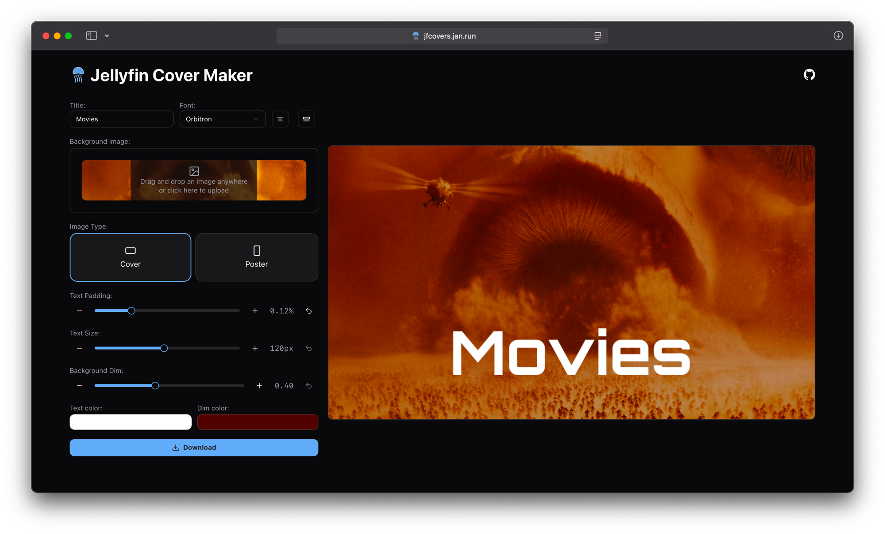
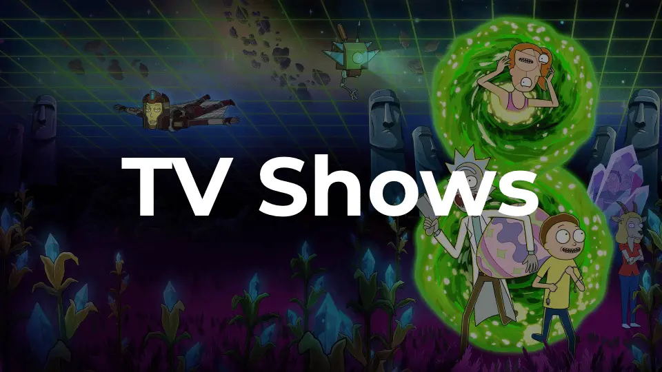

# Jellyfin Cover Maker

Easily create clean and consistent covers for your Jellyfin libraries.
With the default settings, you can generate a Jellyfin-like cover instantly, or you can fully customize them with custom fonts, dim color and much more for a more personal look.

## How to use

1. Go to https://jfcovers.jan.run/
2. Enter the title for your cover (e.g. Movies, Anime, Music)
3. Upload an image or artwork you'd like to use as the background
4. Adjust any additional configuration as you like
5. Download the finished cover and add it to your Jellyfin library

## Examples

<table>
  <tr>
    <td>
      
    </td>
    <td>
      
    </td>
  </tr>
  <tr>
    <td>
      
    </td>
    <td>
      
    </td>
  </tr>
</table>

## Disclaimer

The movie posters and images shown in the examples are not owned by me and are only used for demonstration purposes to showcase how the Jellyfin Cover Maker works. All rights belong to their respective owners.
